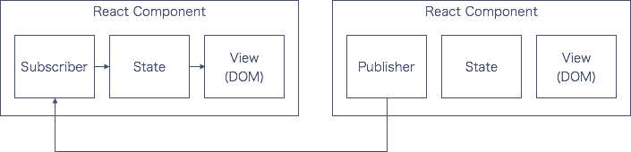

# React + PubSubJS

> A Hacker News implementation built on [React](http://facebook.github.io/react/) and [PubSub](https://github.com/mroderick/PubSubJS)

## Why PubSub pattern?

It's a simple solution to the communication between non-related React's components without the Flux architectural pattern or Parent-Child DOM structure.

### PubSub communication

### Facebook way

#### Parent-child communication

> For parent-child communication, simply pass props.

  - [Communicate Between Components](https://facebook.github.io/react/tips/communicate-between-components.html)

Parent-child communication pattern encapsulate state and relation to a component. But this pattern often cause unnecessary bloated DOM.

#### Flux

>

- [Communicate Between Components](https://facebook.github.io/react/tips/communicate-between-components.html)

## Questions on the stackoverflow

- [How to communicate between Components with out flux in React.js](http://stackoverflow.com/questions/30017309/how-to-communicate-between-components-with-out-flux-in-react-js)

- [How to communicate between independent components in React.JS?](http://stackoverflow.com/questions/23849856/how-to-communicate-between-independent-components-in-react-js)

- [In React.js, how would I set up a simple global event system to communicate between components?](http://stackoverflow.com/questions/31407866/in-react-js-how-would-i-set-up-a-simple-global-event-system-to-communicate-betw)

- [child parent component communication in ReactJS](http://stackoverflow.com/questions/29121945/child-parent-component-communication-in-reactjs)

- [React.js communicate with state object from outside component](http://stackoverflow.com/questions/30187635/react-js-communicate-with-state-object-from-outside-component)

- [React Communication Between Components](http://stackoverflow.com/questions/31165886/react-communication-between-components)
